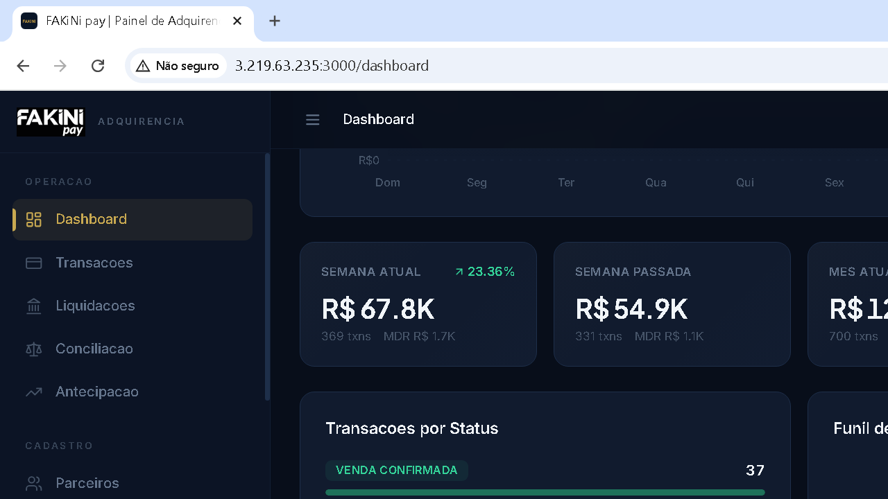
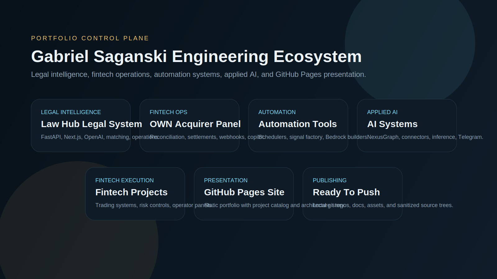

# Gabriel Saganski | AI Applied Engineering Portfolio

This repository is the portfolio control plane for a set of production-style systems discovered and curated from this Windows Server workspace. The goal is straightforward: show end-to-end engineering capability across legal intelligence, fintech operations, automation, and applied AI.

## Overview

The portfolio is organized around systems that demonstrate:

- AI-assisted business workflows with real integrations
- Full-stack product delivery across backend, frontend, and ops layers
- Automation on long-running Windows infrastructure
- Fintech data synchronization, reconciliation, and operational visibility
- Decision engines, schedulers, workers, and reporting pipelines

## Featured Repositories

| Repository | Focus | Stack |
| --- | --- | --- |
| [`law-hub-legal-system`](https://github.com/gabrielrmsaganski-cpu/law-hub-legal-system) | Legal-financial monitoring, AI extraction, operational dashboards | FastAPI, Next.js, PostgreSQL, Redis, OpenAI |
| [`own-acquirer-panel`](https://github.com/gabrielrmsaganski-cpu/own-acquirer-panel) | Acquirer integration, settlements, webhooks, diagnostics, AI copilot | Node.js, TypeScript, Next.js, Prisma, Redis |
| [`automation-tools`](https://github.com/gabrielrmsaganski-cpu/automation-tools) | Windows-native automation, schedulers, signal generation, AI builders | Python, FastAPI, APScheduler, Bedrock, PowerShell |
| [`ai-systems`](https://github.com/gabrielrmsaganski-cpu/ai-systems) | LLM-enabled macro intelligence and agentic analysis pipelines | Python, LangChain, Gemini, aiohttp, Telegram |
| [`fintech-projects`](https://github.com/gabrielrmsaganski-cpu/fintech-projects) | Trading engines, risk controls, market scanning, operator panels | Python, FastAPI, React, Vite, SQLite |
| [`gabrielrmsaganski-cpu.github.io`](https://github.com/gabrielrmsaganski-cpu/gabrielrmsaganski-cpu.github.io) | Public portfolio site for GitHub Pages | Static HTML, CSS, JavaScript |

## Engineering Highlights

- Curated source from real local systems rather than tutorial scaffolding
- Strong emphasis on service boundaries, schedulers, workers, and integrations
- Public-ready repo sanitization: no secrets, no local state, no dependency folders
- Documentation written from actual code structure found on disk
- GitHub Pages front end designed as a high-end engineering portfolio

## System Architecture

The portfolio itself maps to a consistent architecture pattern:

1. Experience layer: dashboards, admin surfaces, and operator views
2. Service layer: REST APIs, auth, orchestration, reporting, and schedulers
3. Intelligence layer: LLM prompts, extraction, ranking, scoring, and decision engines
4. Integration layer: CRM, legal data, acquirer APIs, trading APIs, Telegram, Bedrock
5. Ops layer: Docker, PM2, Windows scripts, cron-like schedulers, health endpoints

More detail lives in [architecture.md](C:\Users\Administrator\gabriel-saganski\portfolio-ai-engineering\architecture.md).

## Screenshots

## Technologies Used

- Python
- FastAPI
- Node.js
- TypeScript
- Next.js
- React
- Prisma
- SQLAlchemy
- Redis
- PostgreSQL
- SQLite
- OpenAI
- Gemini
- AWS Bedrock
- Docker Compose
- PM2
- GitHub Pages

## Future Improvements

- Add public deployment links for each runnable system
- Publish deeper case studies with metrics and architecture decisions
- Expand automated screenshot coverage for every UI module
- Add CI workflows to the curated repos before public push
