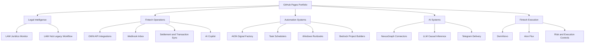

# Portfolio Architecture

## Intent

The portfolio is structured as an ecosystem, not as isolated demo repos. Each repository represents a major engineering capability area and together they show consistent thinking across product architecture, automation, AI integration, and operations.

## Portfolio Map

## Design Principles

- Favor systems with real boundaries: API, UI, scheduler, worker, persistence, and integrations
- Show applied AI as one component inside a broader product architecture
- Prefer operational maturity over experimental novelty
- Preserve original engineering intent while curating public-safe source

## Evidence Base

The repository selection and descriptions are grounded in the local scan documented in [docs/local-project-scan.md](C:\Users\Administrator\gabriel-saganski\portfolio-ai-engineering\docs\local-project-scan.md).

## Delivery Pattern

Each curated repository includes:

- `README.md` for recruiter-facing context
- `architecture.md` for engineering depth
- `docs/` for source lineage and operational notes
- `screenshots/` for UI captures or visual system maps

## Publishing Model

These repos are prepared for manual push to `github.com/gabrielrmsaganski-cpu/*` and for the public site at `https://gabrielrmsaganski-cpu.github.io/`.
